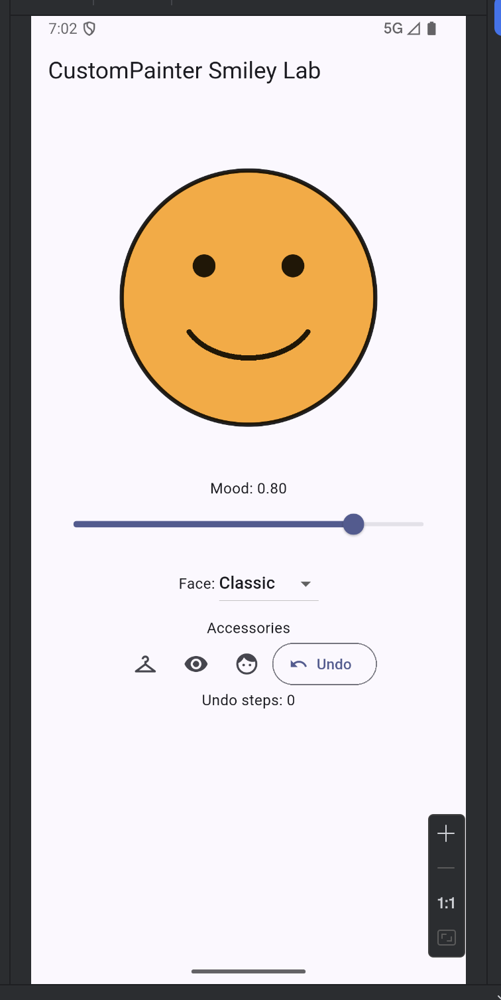
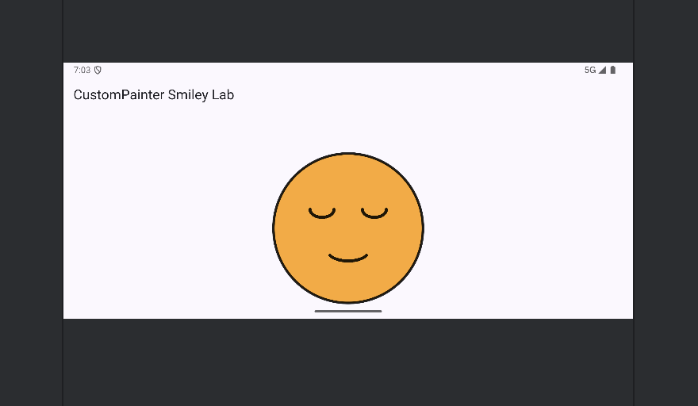

# Activity 06 Critical Thinking

**Student:** Darsh Rathi  
**Topic:** Measure and improve the smile arc

## Response

In my `SmileyPainter`, I placed the face at `Offset(size.width / 2, size.height / 2)` and calculated its radius with `size.shortestSide * 0.4`. For the classic happy face at the starting mood of `0.80`, I centered the mouth at `Offset(center.dx, center.dy + radius * 0.1)`, used a width of `radius * 1.05`, and used a height of `radius * (0.55 + mood * 0.25)`. I drew the smile with a start angle of `0.15 * pi` and a sweep angle of `0.70 * pi`, which keeps the arc centered below the eyes. When I tested the app, portrait showed the complete face and controls without overflow, while landscape kept the face circular and centered and allowed the lower controls to remain reachable by scrolling, so I did not need to change the coordinates. The drawing remains responsive because its center, radius, facial features, and accessories are calculated from the available `Size` instead of fixed screen coordinates, and `shouldRepaint` returns true only when mood, face type, color, or an accessory value changes.

## Phone-Emulator Screenshot

### Portrait

### Landscape

